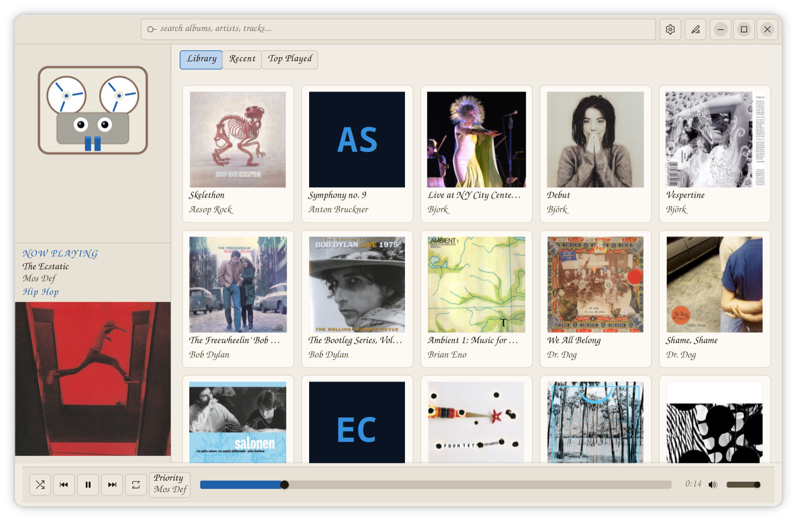
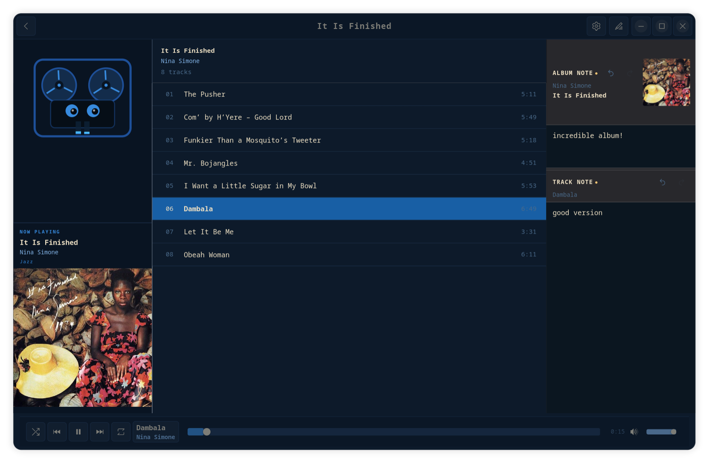

# Open Reel

I have a large local music library and wanted a player that felt right -- actually native, started fast, had real search, and looked like it belonged on a desktop.

So I asked Claude to vibe code one while I cleaned my basement. Native GTK4, Python, GStreamer. No Electron, no web runtime, no internet required. It reads your folders and plays your music. It never touches your files.




## How it thinks about your music

**A folder is an album.** Every audio file in a folder belongs to one album, regardless of what the tags say. If you have a folder called `Ok Computer`, every track in it is part of that album -- even if a tagger retitled some tracks under a different release name.

This means:
- Moving a folder changes what album its tracks belong to
- Renaming a folder changes the album name shown (falls back to folder name when no album tag is set)
- Nested folders each form their own album -- `Artist/Album A/` and `Artist/Album B/` are two separate albums
- Tags are still read for track titles, artists, genre, and track order -- just not used to group albums

Track order within an album uses the `track` tag if present, then falls back to alphabetical filename order. Discs are supported via the `disc` tag.

## User guide

**First launch:** you will be prompted to choose a music folder. The app scans it in the background and the grid appears within seconds. You can add more folders (or remove them) any time in Settings.

**Browsing:** the home screen shows all albums as a grid. Click any album to see its track list. Click the back button or press Escape to return to the grid.

**Playing:** click a track to play it. Or hover over an album card and click the play button that appears to start from the first track without opening the track list.

**Now playing:** the left panel always shows what is currently playing -- album title, artist, and cover art. The bottom bar has the scrubber, time, shuffle, repeat, and volume.

**Shuffle and repeat:** shuffle randomizes play order within the current album. Repeat cycles through off / album / track (track repeat shows a "1" badge on the button).

**Notes:** click the notes icon in the header to open the notes panel on the right. You can write a note about the album and a separate note about the current track. Notes are saved as plain `.md` files in `~/.local/share/musicplayer/notes/` -- one file per album, one per track.

**Rescanning:** if you add or move music files, open Settings and click "rescan library". The app also scans on every launch. Files you have deleted or moved are removed from the library on the next scan.

**Genre:** shown in small text in the left panel when the playing track has a genre tag.

**Themes and fonts:** Settings (gear icon) lets you switch between 8 built-in themes and choose any system font. Changes are instant.

## Features

- Album grid with cover art (embedded tags or folder image)
- Click an album to see the track list; click a track to play
- Hover play button on album cards -- plays without opening the track list
- Now-playing bar with scrubber, time, shuffle, repeat, and volume
- Repeat modes: off / album / track (with "1" badge)
- Shuffle within an album (Fisher-Yates)
- Library / Recent / Top Played tabs above the grid
- Per-album and per-track notes saved as plain `.md` files
- Genre display from track tags
- Animated mascot "The Deck" -- reel-to-reel with eye tracking, idle glances, blinking, spinning reels, and stereo VU bars
- 8 built-in themes with live switching
- System font picker -- family, size, style, and weight all apply
- MPRIS2 support -- media keys, GNOME shell now-playing, lock screen controls
- Multiple music folders (add/remove in Settings)
- Rescan button in Settings
- Desktop launcher (`.desktop` file + shell wrapper)
- Keyboard shortcuts: `Ctrl+Q` / `Ctrl+W` to quit

## Requirements

All dependencies are system packages -- no pip install needed.

```
python3
python3-gobject        (PyGObject / GTK4 bindings)
python3-gst-1.0        (GStreamer Python bindings)
python3-mutagen        (audio tag reading)
python3-dbus           (MPRIS2 / media keys)
gstreamer1-plugins-good
gstreamer1-plugins-bad-free
libadwaita
```

On Fedora:

```bash
sudo dnf install python3-gobject python3-gst1 python3-mutagen \
                 python3-dbus gstreamer1-plugins-good \
                 gstreamer1-plugins-bad-free libadwaita
```

## Running

```bash
git clone https://github.com/BillMoriarty/open-reel.git
cd open-reel
python3 run.py
```

On first launch you will be prompted to choose a music folder. The app scans it in the background and is ready in seconds.

## Desktop launcher (optional)

Create `~/.local/bin/openreel`:

```bash
#!/bin/bash
exec python3 /path/to/open-reel/run.py "$@"
```

Create `~/.local/share/applications/com.openreel.app.desktop`:

```ini
[Desktop Entry]
Version=1.0
Type=Application
Name=Open Reel
Exec=openreel
Icon=multimedia-player
Terminal=false
Categories=Audio;Music;Player;
StartupWMClass=com.openreel.app
```

Then:

```bash
chmod +x ~/.local/bin/openreel
update-desktop-database ~/.local/share/applications/
```

## Data locations

| What | Where |
|---|---|
| Library database | `~/.local/share/openreel/library.db` |
| Album art cache | `~/.cache/openreel/art/` |
| Notes | `~/.local/share/openreel/notes/` |
| Config | `~/.config/openreel/config.toml` |

The app never touches your music files. No renaming, no moving, no tag writing.

## Themes

Open Settings (gear icon) to switch themes. The change is instant and persists across restarts.

| Theme | Style |
|---|---|
| Technics Blue | Dark -- deep navy, warm cream text, Technics blue accents |
| Phosphor Green | Dark -- terminal green on near-black |
| Warm Amber | Dark -- amber on dark brown |
| OLED Dark | Dark -- pure black, white accents, maximum contrast |
| Daylight | Light -- warm off-white with blue accents |
| OLED Light | Light -- pure white, black accents, maximum contrast |
| Warm Paper | Light -- cream and sepia tones |
| Sage | Light -- muted sage green |

## License

MIT
